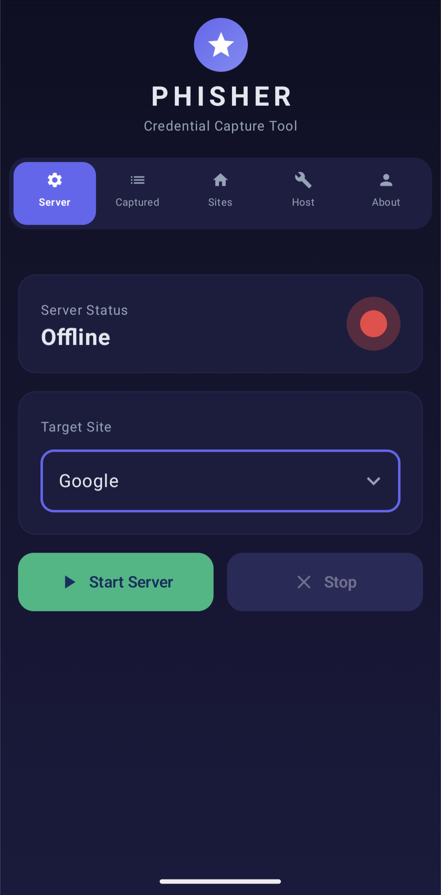

# 🚀 PhisherAndroid  
### Android Phishing Simulation Framework for Cybersecurity Education

PhisherAndroid is an **Android-based credential capture and phishing simulation tool** built for **cybersecurity awareness, red-team training, and authorized penetration testing**.  
It demonstrates how realistic login pages and social engineering techniques can deceive users — **strictly in controlled and legal environments**.

> ⚠️ **DISCLAIMER**  
> This project is intended **ONLY** for educational purposes, security research, and authorized penetration testing.  
> Any misuse for illegal or unethical activities is strictly prohibited.  
> The author assumes **no responsibility** for misuse.

---

## 🧠 Why PhisherAndroid?

Human error is one of the weakest links in security. PhisherAndroid helps to:
- Demonstrate real-world phishing techniques
- Train users to recognize fake login pages
- Teach offensive security concepts responsibly
- Perform controlled red-team simulations

---

## 📸 Screenshots

### 📱 App Interface

> Screenshots are located in the `screenshots/` directory.

<p align="center">
  
  
  
</p>

> *(Rename image filenames above if your actual files differ.)*

---

---

## ✨ Key Features

### 🔐 Login Page Templates
Built-in realistic login templates:
- Google  
- Instagram  
- Facebook  
- GitHub  
- LinkedIn  
- Telegram  
- SKCET  

📦 Supports **custom Flask (Python) template imports**

---

### 🌐 Networking & Capture
- Embedded **NanoHTTPD** local web server  
- Real-time credential capture  
- Browser & IP address detection  
- Timestamped logging  
- Credentials categorized by target site  

---

### 📱 Android Experience
- Built using **Jetpack Compose**
- **Material 3** dark glassmorphism UI  
- Smooth animations and modern UX  
- Clean **5-tab navigation**:
  - Dashboard  
  - Templates  
  - Captured Data  
  - Hosting  
  - Settings  

---

### 🚀 Hosting & Sharing
- One-tap **Termux integration**
- Public hosting for demos and labs
- Ideal for classrooms, workshops, and CTFs

---

## 🛠 Tech Stack

| Layer | Technology |
|------|-----------|
| Language | Kotlin |
| UI | Jetpack Compose |
| Design | Material 3 |
| Server | NanoHTTPD |
| Hosting | Termux |
| Templates | HTML / Flask (Python) |


## 📱 How It Works

1. Launch the app and select a phishing template  
2. The app starts a **local HTTP server**  
3. The generated URL is opened in a browser  
4. A realistic login page is shown  
5. Submitted credentials are captured instantly  
6. Data is logged with metadata (IP, browser, timestamp)

Perfect for **live demonstrations and training sessions**.

---

## 📦 Installation & Setup

### Requirements
- Android Studio (latest version)
- Physical Android device (recommended)

### Steps
```bash
git clone https://github.com/CuteKitty0000/PhisherAndroid.git
